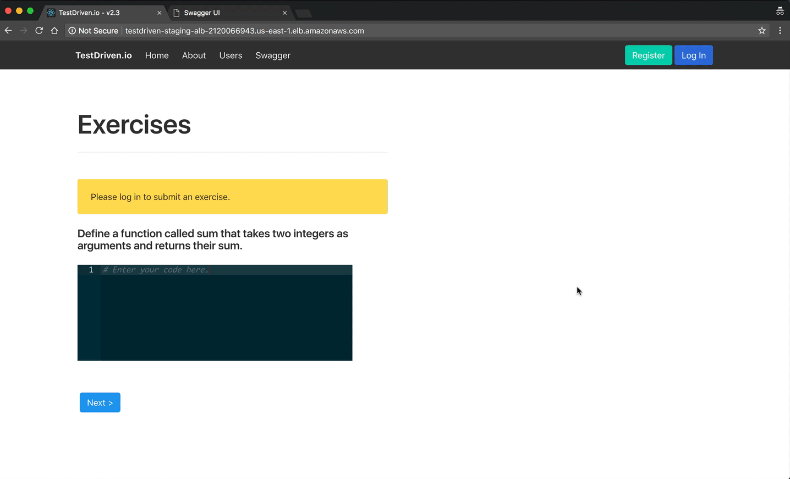
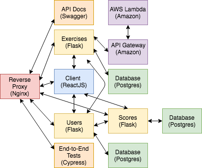

# Microservices with Docker, Flask, and React

## App Overview

A code evaluation tool for grading code exercises, similar to Codecademy, 
with a number of services written in Python and Flask along with a client-side 
JavaScript and React service. The app, itself, will allow a user to log in and
submit solutions to a coding problem. They will also be able to get feedback on
whether a particular solution is correct or not.

**Final app:**

The twelve-factor app pattern will be used to develop and design each microservice.

Along with twelve-factor, is Test-Driven Development (TDD), writing tests first
when it makes sense to do so. The focus will be on server-side unit and 
integration tests, client-side unit tests, and end-to-end tests to ensure 
the entire system works as expected.

Finally, Docker and container orchestration to help manage, scale, and deploy the fleet of microservices.

